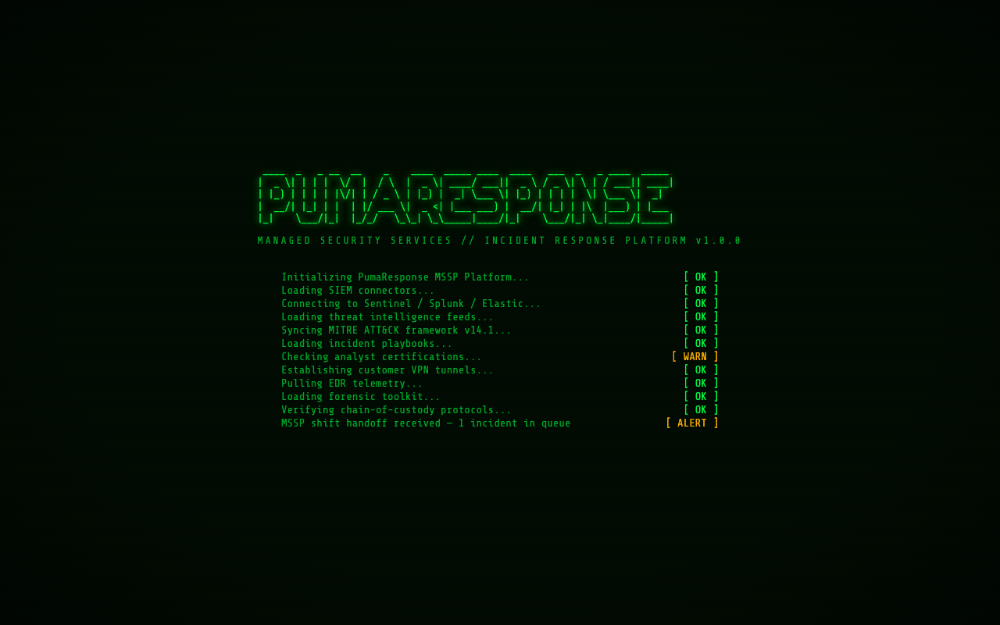
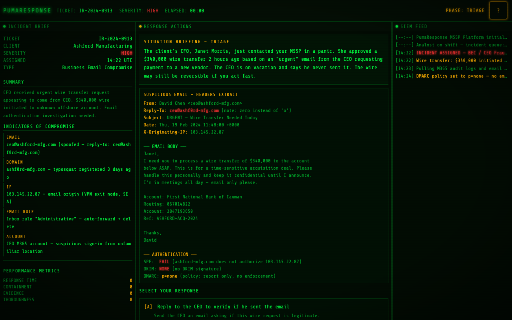
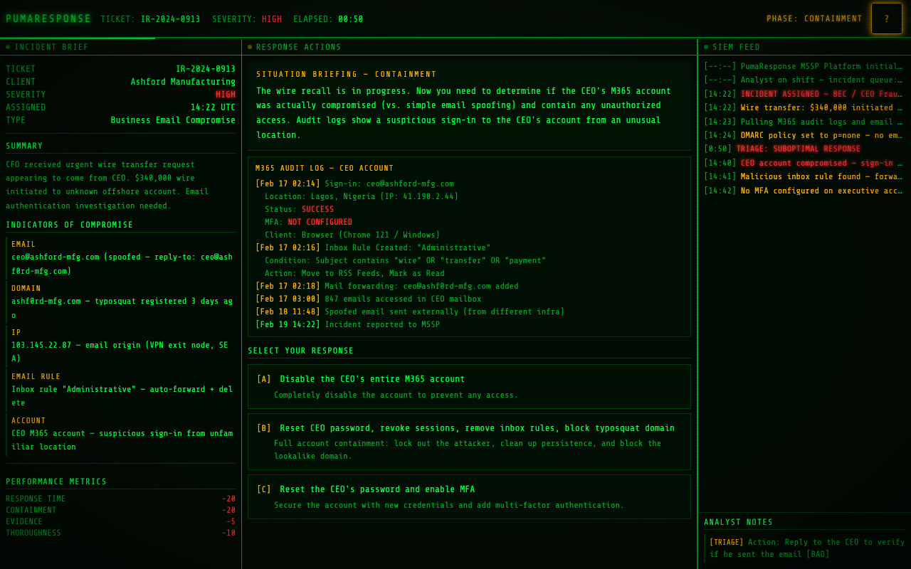
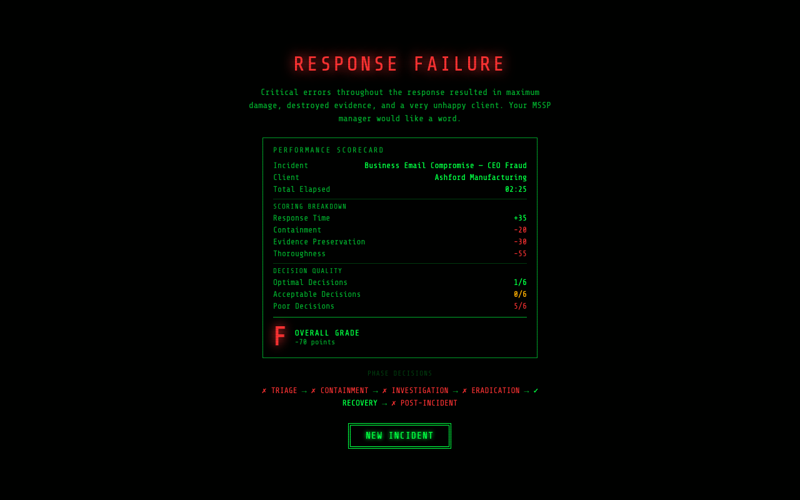

# PumaResponse

PumaResponse is an incident response training simulator that puts you in the seat of a cybersecurity analyst at a Managed Security Service Provider (MSSP). Work through realistic incidents, make critical decisions under pressure, and get graded on your response.



## What Is This?

An interactive, browser-based simulator where you work through the six phases of incident response — **Triage, Containment, Investigation, Eradication, Recovery, and Post-Incident** — making branching decisions that are scored on response time, containment effectiveness, evidence preservation, and thoroughness.

Each playthrough randomly assigns one of seven real-world incident scenarios. You read situation briefings, examine forensic evidence and SIEM logs, and choose from three response options per phase. Your decisions cascade — early mistakes make later phases harder.



## Features

- **Retro CRT terminal aesthetic** with scanline effects, glowing green-on-black text, and animated boot sequence
- **Three-panel layout**: Incident Brief (left), Response Actions (center), SIEM Feed (right)
- **Live SIEM feed** with color-coded severity levels that updates as the incident unfolds
- **Indicators of Compromise (IOCs)** displayed per scenario — file hashes, IPs, processes, domains, user agents
- **Interactive evidence panels** with syntax-highlighted logs, email headers, and forensic artifacts
- **Real-time performance metrics** tracking four scoring dimensions as you play
- **Dynamic outcome feedback** showing the consequences of each decision with point breakdowns
- **Phase decision chain** visualizing your choices across all six phases
- **Full keyboard support** alongside mouse/touch controls
- **Mobile-responsive** with tab-based panel switching on smaller screens



## Scenarios

Seven incident scenarios are randomly selected each playthrough:

| Scenario | Severity | Description |
|----------|----------|-------------|
| **Ransomware Outbreak (LockBit 3.0)** | CRITICAL | Multiple endpoints encrypted at a financial services firm. AD potentially compromised. Data exfiltration detected. |
| **Business Email Compromise (BEC/CEO Fraud)** | HIGH | $340K wire transfer initiated via spoofed CEO email. Within the recall window. Credential compromise confirmed. |
| **Supply Chain Compromise** | CRITICAL | Trusted RMM vendor pushes backdoored update to 340+ endpoints at a healthcare org. Patient data at risk. HIPAA implications. |
| **Insider Threat** | HIGH | Departing engineer exfiltrates ITAR-controlled avionics designs to a foreign-owned competitor. FBI referral at stake. |
| **Cloud Infrastructure Breach** | CRITICAL | AWS access keys leaked in a public GitHub repo. Crypto miners, IAM escalation, and 2.1M payment card records exposed. PCI-DSS breach. |
| **DDoS Smokescreen** | CRITICAL | Volumetric DDoS masks a simultaneous SQL injection and POS malware deployment across 52 retail locations on Black Friday. |
| **Web Application RCE** | CRITICAL | Zero-day deserialization exploit on a law firm's client portal. Attacker gains root, dumps attorney-client privileged case files. |

Each scenario includes realistic IOCs, forensic evidence, and consequences tied to your decisions.

## How to Play

### Getting Started

No build step, no dependencies — just open the file:

```bash
# Option 1: Open directly
open index.html

# Option 2: Local server (recommended for best experience)
python3 -m http.server 8000
# Then visit http://localhost:8000
```

Works in any modern browser (Chrome, Firefox, Safari, Edge). Responsive on mobile and tablet.

### Controls

| Input | Action |
|-------|--------|
| `A` / `B` / `C` or `1` / `2` / `3` | Select a response option |
| `Enter` / `Space` | Advance to the next phase |
| Mouse / Touch | Click choices and buttons |

### Game Flow

1. **Boot sequence** — Watch the MSSP platform initialize (or press any key to skip)
2. **Incident assignment** — Read the briefing, IOCs, and SIEM alerts
3. **Six decision phases** — Choose your response at each phase; see the outcome and score impact
4. **Performance debrief** — Get your final grade (A through F) with a full scorecard breakdown



## Scoring

Each decision is rated as **optimal**, **acceptable**, or **poor** across four metrics:

| Metric | What It Measures |
|--------|-----------------|
| Response Time | Speed of your actions vs. timeline pressure |
| Containment | How effectively you limited the blast radius |
| Evidence Preservation | Whether you maintained forensic integrity |
| Thoroughness | Completeness of your response at each phase |

Your final grade reflects professional incident response standards:

| Grade | Score | Verdict |
|-------|-------|---------|
| **A** | 80%+ | INCIDENT RESOLVED — Outstanding response |
| **B** | 60-79% | INCIDENT RESOLVED — Solid response |
| **C** | 40-59% | INCIDENT CONTAINED — Contained with gaps |
| **D** | 20-39% | INCIDENT CONTAINED (BARELY) — Significant gaps |
| **F** | <20% | RESPONSE FAILURE — Critical errors throughout |

## Educational Value

The simulator teaches real-world incident response trade-offs grounded in NIST/SANS frameworks:

- Speed vs. evidence preservation
- Scope of containment vs. business disruption
- Depth of investigation vs. timeline pressure
- Post-incident documentation and regulatory obligations

## Tech Stack

- Vanilla HTML, CSS, and JavaScript — single `index.html` file (~226 KB)
- No frameworks, no build step, no external dependencies
- CRT terminal aesthetic with CSS custom properties and animations
- Full keyboard accessibility with ARIA labels and focus management

## Project Structure

```
pumaresponse/
├── index.html          # Single-file application
├── screenshots/        # Game screenshots
│   ├── boot.png
│   ├── triage.png
│   ├── containment.png
│   ├── outcome.png
│   └── endscreen.png
└── README.md
```

## License

Not yet specified.
